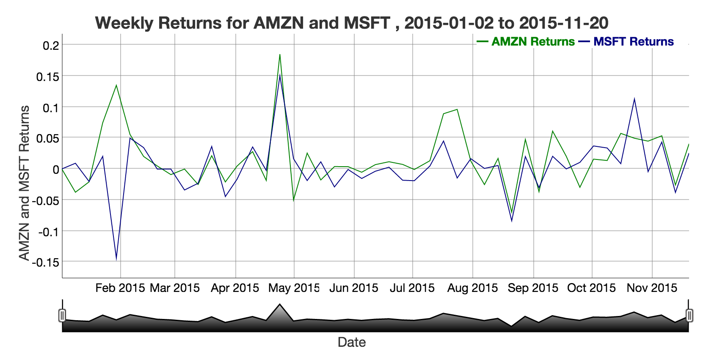
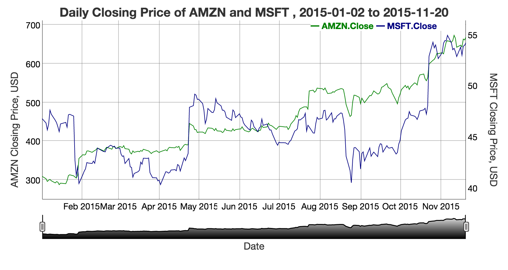

## Project Overview

### Purpose:
Interactively explore historical prices and returns of two user defined stocks

### Steps:
1. Pull stocks from Yahoo finance
2. Use dygraphs to visualize output
3. Explore / analyze charts in an interactive fashion

### Product:
This product is live at https://dstair.shinyapps.io/shiny_course_project

---
## Step 1: Pulling stock data from Yahoo! Finance

The library <code> quantmod </code> is used to pull stock data from Yahoo! Finance. A basic pull is as follows:


```r
library(quantmod)
getSymbols(c('MSFT'),src='yahoo')
```

</br>
The above pull returns the following time series (xts) object:


```
##            MSFT.Open MSFT.High MSFT.Low MSFT.Close
## 2007-01-03     29.91     30.25    29.40      29.86
## 2007-01-04     29.70     29.97    29.44      29.81
## 2007-01-05     29.63     29.75    29.45      29.64
## 2007-01-08     29.65     30.10    29.53      29.93
## 2007-01-09     30.00     30.18    29.73      29.96
```

---
## Step 2: Powerful graphing of time series objects

### The time series object returned by <code>quantmod</code> is great to work with

1. It's indexed by date, so jumping to a date range is fast
2. It's very easy to do the following with 1 command, <code>weeklyReturn</code>:
    + 1-line aggregation by time period (i.e., week, month, year)
    + Calculate rate of return

##### The <code>weeklyReturn</code> commmand is behind the following chart:
    
<div style='text-align: center;'>
    
</div>

---
## Step 3: An example analysis of two stocks

1. View the shinyapps.io site with default values: tickers "AMZN" and "MSFT", dates "2015-01-02" to "2015-11-20"
2. Note a large shift at the end of January 2015
3. Zoom in on this time period, using the slider at the bottom of either chart
4. Hovering over the chart, we see exact prices and dates. We can discern that MSFT dropped from 47.01 to 40.4 in the same 4-day span that AMZN rose from 309.56 to 354.53.

<div style='text-align: left;'>
    
</div>

